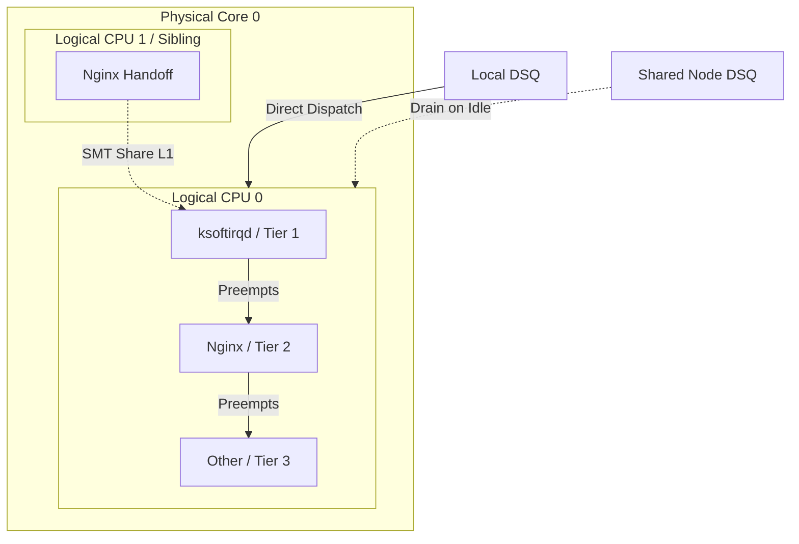

# scx_vajra
Latency aware BPF scheduler for web servers with strict cache affinity and immediate noise preemption

## 1. Overview

this scheduler aims to minimize latency and maximize throughput for the web servers.
Building upon the advanced topology awareness features of the existing scx_flash, it introduces "tierd scheduling" and "affinity & exclusivity"
algorithm to strictly priotize specific critical paths.

## 2. Scheduling Policy

Tasks are classified into three tiers with strict prioritization applied.

| Tier | Role | Tasks | Policy |
| :--- | :--- | :--- | :--- |
| **1** | **Critical** | `ksoftirqd`, `rcu_sched` | **Absolute Priority.** Preempts everything. Pinned to local CPU. |
| **2** | **Prioritize task** | web server | **High Priority.** Preempts Tier 3. Infinite Slice. |
| **3** | **Noise** | Sidecars, Agents, SSH | **Low Priority.** Banished to Shared/Node DSQs. Runs only in gaps. |

